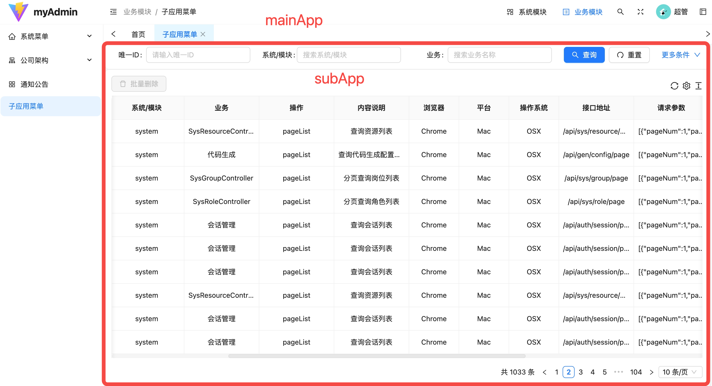

<center>
    <h3>moyu-micro-admin</h3>
    <p>基于qiankun微前端架构的管理系统</p>
</center>

## 项目简介

[moyu-micro-admin]()是在[moyu-admin]()的基础上，采用[qiankun](https://qiankun.umijs.org/zh/guide)微前端架构设计，支持将多个独立的前端应用有机结合成一个整体系统。特别适用于多团队、多技术栈的大型项目。

项目由主应用和多个子应用共同组成，每个微应用都是一个独立的项目，可以独立开发、独立部署、独立访问，并可作为一个有机整体呈现。

下图展示了一个由主应用`mainApp`和子应用`subApp`组成的系统，图中的左侧菜单栏和上部导航栏是主应用提供的，红框标记的内容是子应用提供的，效果看起来像是主应用将子应用的一部分内容内嵌了进去。



## 项目特色
微前端架构能够解决多个应用的有机组合问题，微前端的特点本项目均具备：

- **技术栈无关**: 主框架不限制接入应用的技术栈，微应用具备完全自主权。
- **独立开发、独立部署**: 微应用仓库独立，可独立开发，部署完成后主框架自动完成同步更新。
- **样式隔离**: 能够确保微应用之间样式互相不干扰。
- **JS 沙箱**: 确保微应用之间 全局变量/事件 不冲突。

## 目录结构
项目包含了一个主应用`mainApp`和一个子应用`subApp`的代码示例，每个应用都可以是独立的代码仓，由不同的团队独立开发、独立部署。
项目目录结构如下：(主应用比子应用多一个微前端配置文件`microApp.ts`)

```
├── mainApp
│   │   ├── public          # 静态资源
│   │   ├── src
│   │   │   ├── api         # API 请求相关
│   │   │   ├── layout      # 布局文件
│   │   │   ├── router      # 路由
│   │   │   └── ...
│   │   │   ├── views       # 页面视图文件
│   │   │   ├── App.vue     # vue应用入口组件
│   │   │   ├── main.ts     # 入口 TS 文件
│   │   │   └── microApp.ts # 主应用的微前端配置文件
│   │   ├── index.html      # 入口 HTML 文件
│   │   ├── package.json    # 项目配置文件
│   │   ├── vite.config.js  # Vite 配置文件
│   │   └── ...
│
├── subApp
│   │   ├── public          # 静态资源
│   │   ├── src
│   │   │   ├── api         # API 请求相关
│   │   │   ├── layout      # 布局文件
│   │   │   ├── router      # 路由
│   │   │   └── ...
│   │   │   ├── views       # 页面视图文件
│   │   │   ├── App.vue     # vue应用入口组件
│   │   │   └── main.ts     # 入口 TS 文件
│   │   ├── index.html      # 入口 HTML 文件
│   │   ├── package.json    # 项目配置文件
│   │   ├── vite.config.js  # Vite 配置文件
│   │   └── ...
├── README.md               # 说明文档
└── ...

```

