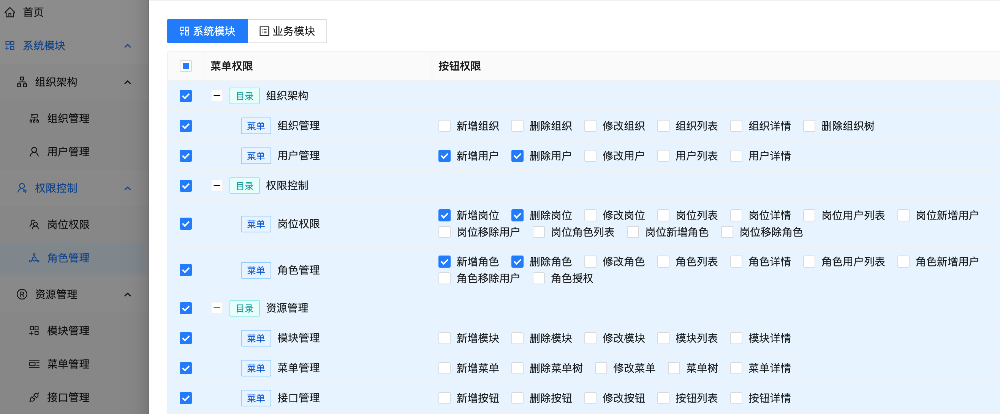
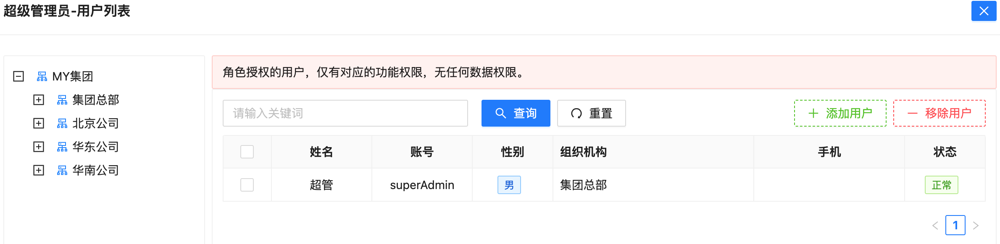
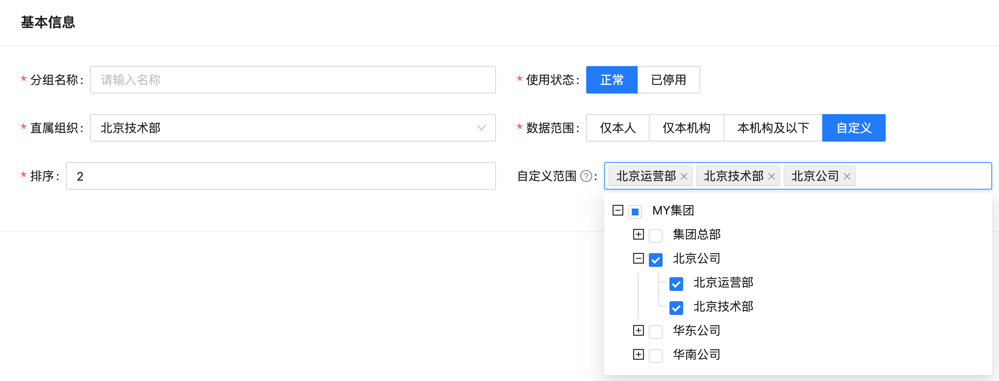

## 权限控制基础
权限控制即对资源的访问控制，根据资源种类的不同，权限可分为`功能权限`和`数据权限`。

* 功能权限：在前面章节中`资源管理的基础上`进行控制，如菜单是否可见，按钮是否可点，接口是否有权限访问等
* 数据权限：通过数据库进行控制，本系统在`组织机构的基础上`支持行级别的数据权限控制，本项目中数据权限分为：

`本人数据`：仅可访问本人创建的数据记录。
`本节点数据`：可以访问本节点(本公司、本部门)下直接包含的数据，但是不可递归访问本节点下子节点包含的数据，即不包括间接包含的数据。
`本节点及以下`：可以访问本节点(本公司、本部门)下的所有数据，包括直接包含和间接包含的数据。
`自定义`：可以自由指定能够访问哪些节点下直接包含的数据。

本系统在基于角色的权限管理模型RBAC的基础上，引入了角色组(Group)的概念，形成了以Group为核心的权限管理体系，支持`一岗多角`和`一人多岗`。

## 角色管理
角色是分配功能权限的载体，本系统中一个角色应该具有的权限相对固定，如仓库管理人员总是具有出库入库、库存盘点等相关的权限，企业管理人员总是具有组织管理、人员管理相关的权限，审计相关人员总是具有读权限而不具有写权限等。
角色权限相对固定的好处也显而易见，不仅可以通过角色直观的判断应该具有哪些权限，还可以简化权限的分配管理工作。

### 角色分配权限
角色分配权限即为角色添加功能权限，下图即`角色管理`中，为某角色分配权限的页面，直接勾选相应的菜单和按钮即可。

### 角色分配用户
角色分配权限即为角色添加用户，将角色赋予某个用户。
虽然系统保留了直接将角色赋予某用户的途径，但本系统主要围绕`岗位(Group)`进行权限管理，数据权限也是通过`岗位(Group)`控制的，因此不应直接将角色分配给某个用户，否则无数据权限。(可根据需要禁用此功能)

## 岗位权限
本系统中`岗位(Group)`等同于`角色组`，是用来进行权限控制的核心概念，角色、数据权限、授权的用户均与`岗位(Group)`直接关联。

### 岗位的数据权限
在创建岗位时，可直接设置此岗位关联的数据权限

### 岗位分配角色
岗位分配角色后，岗位即拥有了此角色下的所有功能权限，同时一个岗位可以分配多个角色，即支持`一岗多角`

### 岗位分配用户
岗位分配用户后，此用户即拥有与此岗位相关联的所有权限，包括`功能权限`和`数据权限`。

一个用户可以被分配多个岗位，即支持`一人多岗`，用户登录后可以通过`岗位切换`功能实现不同岗位身份的变化，切换岗位后对应的`功能权限`和`数据权限`也随着变化
