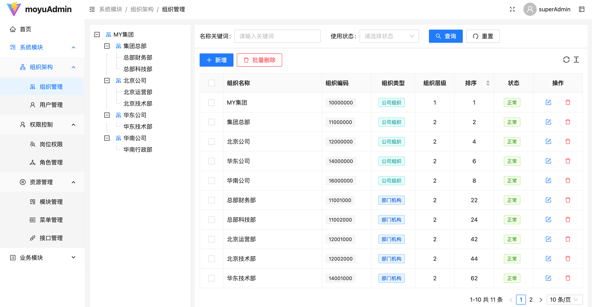

    <h3>moyu-admin</h3>
    
基于SpringBoot、SpringSecurity、MybatisPlus的权限后台管理系统

## 项目简介

[moyu-admin](https://www.baidu.com)基于 JDK 8、Spring Boot 2.7、Spring Security 6、JWT、Redis、Mybatis-Plus、Vue3、Ant-Design-Vue 构建的前后端分离的权限管理系统。

## 项目特色

- **开发框架**: 使用 Spring Boot 2.7 和 Vue 3，以及 Ant-Design-Vue 等主流技术栈，实时更新。

- **安全认证**: 结合 Spring Security 和 JWT 提供安全、无状态、分布式的身份验证和授权机制。

- **权限管理**: 基于 RBAC 模型，实现细粒度的权限控制，涵盖接口方法和按钮级别。精准控制功能权限和数据权限。

- **功能模块**: 包括组织机构、用户管理、岗位管理、角色管理、菜单管理、接口管理等多个功能。
 
- **独创功能**: 提供兼职岗位功能，不同岗位对应不同的权限，允许用户进行岗位切换。

## 项目地址

在线演示：[https://vue.moyu.com](https://vue.moyu.com)

## 项目截图

