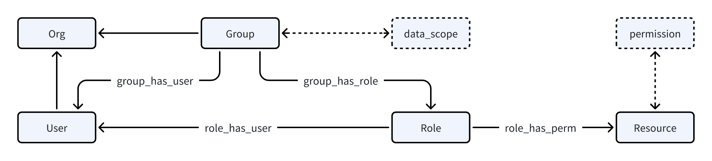

## 基础功能

- **组织机构**: 组织机构信息维护，公司、部门、层级关系、组织树。

- **用户管理**: 支持用户登录、用户信息维护、所属部门维护。

- **资源管理**: 模块、菜单、接口、按钮等资源管理。

- **权限管理**: `功能权限`和`数据权限`管理，权限、角色、角色组管理，支持一人多岗、一岗多角。

## 组织机构与用户
组织机构的节点通常有公司、部门、虚拟节点等不同类型，为了构建组织关系树，除了名称name、编码code之外，还需要用于标识父节点的字段parent_code，和从根节点到本节点的访问路径。

```SQL title="组织机构模型示例"
create table sys_org
(
    `id`          BIGINT(20)    NOT NULL AUTO_INCREMENT COMMENT '主键id',
    `name`        VARCHAR(64)   NULL DEFAULT NULL COMMENT '名称',
    `code`        VARCHAR(64)   NULL DEFAULT NULL COMMENT '编码',
    `parent_code` VARCHAR(64)   NULL DEFAULT '0' COMMENT '父编码',
    `org_type`    TINYINT(5)    NULL DEFAULT NULL COMMENT '组织机构类型(字典 1公司组织 2部门机构 3虚拟节点)',
    `org_path`    VARCHAR(1024) NULL DEFAULT NULL COMMENT '组织机构层级路径,逗号分隔,父节点在后',
    primary key (`id`)
) ENGINE = InnoDB CHARACTER SET = utf8mb4 COMMENT = '组织机构表';
```
用户除了具备用户信息之外，还应归属于一个组织机构节点。

```SQL title="用户模型示例"
create table sys_user
(
    `id`              BIGINT(20)    NOT NULL AUTO_INCREMENT COMMENT '主键id',
    `account`         VARCHAR(64)   NULL DEFAULT NULL COMMENT '账号',
    -- ......

    `org_code`        VARCHAR(64)   NULL DEFAULT NULL COMMENT '直属组织编码',
    `org_name`        VARCHAR(64)   NULL DEFAULT NULL COMMENT '直属组织名称',
    `org_path`        VARCHAR(1024) NULL DEFAULT NULL COMMENT '组织机构层级路径,逗号分隔,父节点在后',
    primary key (`id`)
) ENGINE = InnoDB CHARACTER SET = utf8mb4 COMMENT = '用户信息表';
```

## 资源与权限
权限是对资源的保护，根据要保护的资源不同，可以把权限分为`功能权限`和`数据权限`

`功能权限`是对资源的访问控制，是权限控制的基础，常见的资源有菜单、页面、按钮、接口等。
`数据权限`是对数据的访问控制，根据控制粒度不同可分为库级、表级、行级、字段级等。

### 功能权限设计
`功能权限`是对不同资源的访问控制
对于菜单和页面，有的菜单对应一个页面，可以定义为菜单；有的菜单不对应页面，仅表示目录，可定义为目录。这类资源的访问控制可分为是否可见。
对于按钮，在前端的表现为一个具体的按钮，访问控制分为是否可见(是否可点击)，但点击按钮之后往往对应一个后端接口来进行相应操作的处理，因此按钮常和接口绑定或对应。
对于接口，可能在页面中发生调用，也可能通过按钮点击触发调用，甚至可以直接访问接口地址进行调用，因此需要权限标识进行访问控制。

本项目定义的权限即是对资源的访问控制，资源分类有：模块、目录、菜单、内链、外链、按钮(接口)

* 模块：即最顶级的菜单，用于对多种资源进行归类管理(称应用、子系统也可以) 
* 目录：即目录类型的菜单，不对应展示页面，仅用于包含子目录或菜单，应有属性：路由地址
* 菜单：即对应某个页面，页面需要前端组件进行渲染，应有属性：路由地址、组件地址
* 内链：表现上为一个菜单，但不使用内部组件渲染，而是使用iframe集成一个链接，应有属性：链接地址
* 外链：表现上为一个菜单，点击后打开新的链接，应有属性：链接地址
* 按钮：即操作，对应后端接口，当接口操作需要在前端体现时，可用按钮承载。应有属性：接口地址、权限标识

上述资源均有名称name、唯一编码code，以及用来表示层级归属关系的parent_code字段

```SQL title="资源权限模型示例"
create table sys_resource
(
    `id`            BIGINT(20)   NOT NULL AUTO_INCREMENT COMMENT '主键id',
    `name`          VARCHAR(64)  NULL DEFAULT NULL COMMENT '名称',
    `code`          VARCHAR(64)  NULL DEFAULT NULL COMMENT '编码',
    `parent_code`   VARCHAR(64)  NULL DEFAULT '0' COMMENT '父编码',
    `resource_type` TINYINT(5)   NULL DEFAULT NULL COMMENT '资源类型（字典 1模块 2目录 3菜单 4内链 5外链 6按钮）',
    `path`          VARCHAR(64)  NULL DEFAULT NULL COMMENT '路由地址',
    `component`     VARCHAR(64)  NULL DEFAULT NULL COMMENT '组件地址',
    `permission`    VARCHAR(64)  NULL DEFAULT NULL COMMENT '权限标识',
    `link`          VARCHAR(255) NULL DEFAULT NULL COMMENT '链接地址',
    primary key (`id`)
) ENGINE = InnoDB CHARACTER SET = utf8mb4 COMMENT = '资源权限表';
```

### 数据权限
本项目的数据权限控制为行级，即可以对表中的每行记录进行权限控制。
数据权限的控制通常与组织结构的节点有一定关联，本项目中对数据权限分如下几类：
1. `本人数据`：仅可访问本人创建的数据记录。
2. `本节点数据`：可以访问本节点(本公司、本部门)下**直接包含**的数据，但是不可递归访问本节点下子节点包含的数据，即不包括间接包含的数据。
3. `本节点及以下`：可以访问本节点(本公司、本部门)下的所有数据，包括直接包含和间接包含的数据。
4. `自定义`：可以自由指定能够访问哪些节点下直接包含的数据。

### 岗位与权限
提到组织机构，避免不了讨论岗位这一概念，在现实中岗位通常在公司中真实存在，并且跟组织机构中的某节点(如部门)有关联关系，同时该组织机构中的用户会分配不同的岗位，与系统中`用户组`的概念非常类似，同时现实中不同的岗位往往具有不同的权限(包括`功能权限`和`数据权限`)，因此在本项目中，岗位为`角色组`和`用户组`结合，用Group既表示岗位又表示角色组和用户组，数据权限直接挂接在Group上：

```SQL title="分组信息模型示例"
create table sys_group
(
    `id`          bigint(20)    NOT NULL AUTO_INCREMENT COMMENT '主键id',
    `name`        VARCHAR(64)   NULL DEFAULT NULL COMMENT '名称',
    `code`        VARCHAR(64)   NULL DEFAULT NULL COMMENT '编码',
    `org_code`    VARCHAR(64)   NULL DEFAULT NULL COMMENT '直属组织编码',
    `org_name`    VARCHAR(64)   NULL DEFAULT NULL COMMENT '直属组织名称',
    `data_scope`  TINYINT(5)    NULL DEFAULT NULL COMMENT '数据范围(字典 0无限制 1本人数据 2本机构 3本机构及以下 4自定义)',
    `scope_set`   VARCHAR(1024) NULL DEFAULT NULL COMMENT '自定义scope集合,逗号分隔',
    `org_path`    VARCHAR(1024) NULL DEFAULT NULL COMMENT '组织机构层级路径,逗号分隔,父节点在后',
    primary key (`id`)
) ENGINE = InnoDB CHARACTER SET = utf8mb4 COMMENT = '分组信息表';
```

## 权限管理
在基于角色的权限管理模型RBAC的基础上，为了支持更加复杂的权限管理机制，引入了角色组(group)的概念，并且将数据权限挂接在角色组上，形成了以角色组group为核心的权限管理体系



图中可以看出，仍然保留了角色与用户的关联关系，仍然可以给某用户添加角色，但是角色并不具备数据权限，仅具有功能权限，所以如果用户不属于任何角色组group时，仅能查看自己产生的数据记录，而无其他数据权限。

* 岗位(角色组)Group与角色之间的关联关系是一对多，一个Group支持关联多个角色，即支持**一岗多角**。
* 本项目支持**一人多岗**，权限管理体系与Group直接相关，当用户的岗位切换时，用户的权限(包括`功能权限`和`数据权限`)也会发生变化。

角色与用户、权限的关系，角色组(岗位)与用户、角色的关系，可以使用一个关联关系模型来表示：

```SQL title="关联关系模型示例"
create table sys_relation
(
    `id`            BIGINT(20)  NOT NULL AUTO_INCREMENT COMMENT '主键id',
    `object_id`     VARCHAR(64) NULL DEFAULT NULL COMMENT '对象ID',
    `target_id`     VARCHAR(64) NULL DEFAULT NULL COMMENT '目标ID',
    `relation_type` TINYINT(5)  NULL DEFAULT NULL COMMENT '关系类型(字典 1:role_has_user,2:role_has_perm,3:group_has_user,4:group_has_role)',
    primary key (`id`)
) ENGINE = InnoDB CHARACTER SET = utf8mb4 COMMENT = '关联关系表';
```

